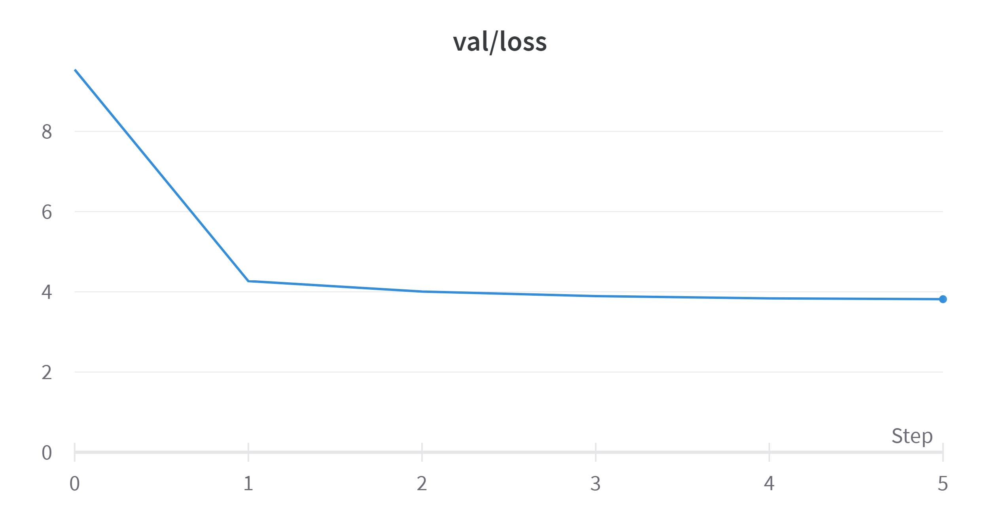

# ChiPoGen

## Introduction
**ChiPoGen** (**Chi**nese **Po**etry **Gen**eration) : A Chinese poems generator using GPT2-based language model.

Inspired by the [nanoGPT](https://github.com/karpathy/nanoGPT) developed by Anandrej Karpathy, the same model structure is applied for training on millions of Chinese poems collected in the [Chinese Potery Dataset](https://github.com/Werneror/Poetry), and then used for Chinese potery generation.

Some generation samples are shown in the following figure:

## Environment
The main project is developed on Windows 10.0 with a CUDA capable GPU (RTX 4070) and still no testing on other OS such as MacOS or Linux. (Suppose there is a merely slight modification for making the model to run on the Linux with GPU, but may require some heavy magic work for MacOS)
- Windows 10.0
- python 3.10
- CUDA capable GPU

## Setting up
For this project, use `conda` to create a virtual environment for packages management. Run the following commands for the virtual environment setting up. Note that the project use `torch.amp` and pytorch version > 1.6 should be fine for running the mixture precision training and inference as mentioned in the [pytorch tutorial](https://pytorch.org/docs/stable/amp.html). Pytorch 2.0+ is encouraged since the AdamW optimizer can use the fused CUDA version which is typically faster than the for-loop, single-tensor implementation.

    conda create -n chipogen python=3.10
    conda install pytorch torchvision torchaudio pytorch-cuda=11.8 -c pytorch -c nvidia
    pip install -r requirments.txt

## Running
First initialize all folders for model training

    python init.py

Then prepare for the data including tokenlization, train-val dataset spliting and saving the poetry training and valuating dataset to a binary file

    python preparation.py

For training the model, configurate the two files in the `configs`:

- `model.json`: the hyperparameters of the model architecture
- `train.json`: the hyperparameters of the model training

Then you have to login to the [wandb](https://wandb.ai/site) for training logging. If you are the first time for training, then the logging interface will be triggered in the command line and you will require an API key of the wandb for logging. Or you can set `wandb_log=False` in the `train.py` (I place the variable in the beginning of the whole training script which is easy for targeting at) to disable the wandb logging. (*Sorry for asking you to directly edit the source code which is commonly annoying*)

Then run the following command on the command line to start model training:

    python train.py

After training the model, the trained weight file (.pth) can be found in `params`. For generation, run the following command in command line:

    python sample.py

The output result will be saved as a .txt file in the new folder `out`.

## Model details
The model uses a standard decoder-only transformer [GPT2](https://paperswithcode.com/paper/language-models-are-unsupervised-multitask) with the following hyperparameters. The total number of model parameters is `26.22` million. (you can play with other configurations)

    "batch_size": 12,
    "block_size": 128,
    "vocab_size": 12966,
    "n_embd" : 384,
    "n_head" : 12,
    "n_layer": 12
    
Note that the vocab_size of the final output layer is the total number of all chars in the Chinese potery dataset which is different from the standard implmentation of the GPT2 (`vocab_size=50257`). After the data processing, there are totally `12966` Chinese chars in the dataset, and this number is chosen to be the vocab_size in the output layer.

## Model training
It takes around 1 hour for finishing the model training on 5000 iters on an RTX 4070 (12G VRAM) GPU. During the training, the VRAM usage is around 2.5G, which is a reference to indicate how much VRAM is required for scaling to a larger model. The `block_size` and `batch_size` can affect the memory usage, while the `n_embd` take the majority response to the model size.

The `val_loss` has been tracked for each 1000 iters and  is ploted on the following figure. 

The final `train_loss` is 3.34 and the evaluation `val_loss` is 3.8169.

